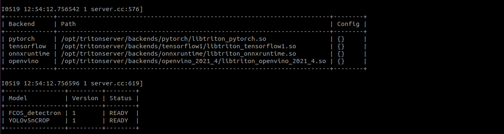

# ROS-gRPC interface client for Triton server inference

## Triton client architecture

The channel refers to `communicator.channel`, where the different types channel of communcation is implemented. To add,
a new one extend the `BaseChannel` interface.

The triton_clients refers to `trition_clients`, where the clients are implemented using available preprocess and postprocess.
Clients are dependent of `postprocess` and `preprocess`.

The inference takes channel and triton_clients object for performing inference on triton client model using given channel.


This repo is a ROS-gRPC interface for remote inferencing with an Inference server e.g. Triton Inference server.
To run this client for inference you have to do following steps:

## Setup the model repository
Before you run the Triton server, you need to setup the model repository for the triton server. These are the models that will be fed with sensor data/samples
later on from the client in this repo. I have setup a model repository for the project in the Minio server. To use it with Triton server, you will need 
access credentials to the MinIO server (contact Naeem).

Once you have your credentials to MinIO, you can put them in a file in your home directory (e.g. in .password-s3fs file) as follows:
```bash
YOUR_MINIO_USERNAME:YOUR_MINIO_PASSWORD
```
Change permissions to following:
```bash
chmod 700 ${HOME}/.passwd-s3fs
```

and install an **s3fs** tool to mount the model repository from MinIO storage server in your local machine.

NOTE! Do not forget to change the MinIO server IP address and the path to the model repository. 
```bash
sudo apt-get update
sudo apt install s3fs
s3fs modelrepository /home/path/to/model_repository -o passwd_file=${HOME}/.passwd-s3fs -o url=http://MINIO_SERVER_IP:9000 -o use_path_request_style -o allow_other
```
To read about how to setup a custom model repository, you can read the following Triton documentation [link](https://github.com/triton-inference-server/server/blob/main/docs/model_repository.md) .
Once you have setup the model repository, you can run the triton server with docker as follows:
## Deploy triton server
For this setup, we tested it on the Triton server version 21.08. You can pull the docker image from here (NVIDIA repository [link](https://catalog.ngc.nvidia.com/orgs/nvidia/containers/tritonserver)[https://catalog.ngc.nvidia.com/orgs/nvidia/containers/tritonserver]))
```bash
docker pull nvcr.io/nvidia/tritonserver:21.08-py3
docker run --gpus 1 --rm -p8000:8000 -p8001:8001 -v/full/path/to/model_repository:/models nvcr.io/nvidia/tritonserver:21.08-py3 tritonserver --model-repository=/models
```
You can use `--gpus all` option to allocate all the available gpus to the Triton server. Once the triton server is up, you should see the available 
models that we can use as arguments to the client. For example in the following image:, 

we have three models named `YOLOv4`, `YOLOv5` and `YOLOv5n` ready at the server.
We can pass these model names as arguments to the `main.py` for inference.
## Performing remote inference with Client 

Before you send sensor data to the Triton server, you need to select the following in `./data/client_parameter.yaml` file: 

1. ROS topic you want to subscribe from sensor input e.g. `sub_topic: '/camera/color/image_raw'`
2. ROS topic you want to publish as inference results e.g. `pub_topic: '/camera/color/detection'`
3. IP address of the triton server or localhost if running locally e.g. `grpc_channel: '10.249.3.13:8001'`

You can select the model, you want to use for your inference and run the following command:

```python
python3 main.py --m YOLOv5n
```
Now your sensor input will be fed to the triton server as gRPC messages and the resulting inference image will be published as ROS topic which you can 
visualize in the ROS ecosystem with rviz. 

#TODOs
1. Perform batched inference input.
2. Variable gRPC inference message size according to size of the image.
3. Ensemble mode with multiple models. 
4. Upload new models with a bash script to the MinIO model repository. 

## Acknowledgements

This repo is heavily based on the work of following repositories, and is only used to setup as a demo of ROS-gRPC-Triton ecosystem. 
If you are interested in their work, give them a thumbs up here:

1. [YOLOv5](https://github.com/ultralytics/yolov5) 
2. [PyTorch YOLOv4](https://github.com/Tianxiaomo/pytorch-YOLOv4)
3. [Triton inference server](https://github.com/triton-inference-server/server)
4. [Trion client](https://github.com/triton-inference-server/client)


